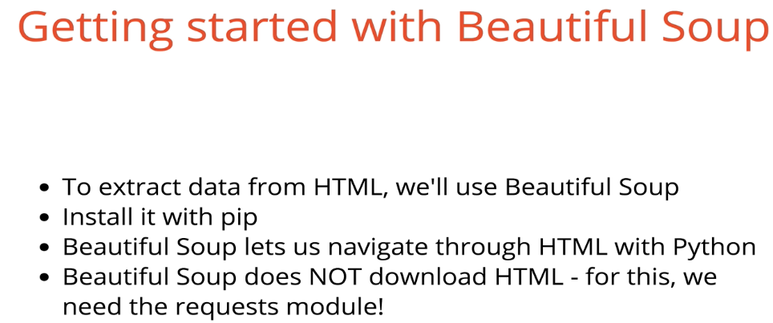
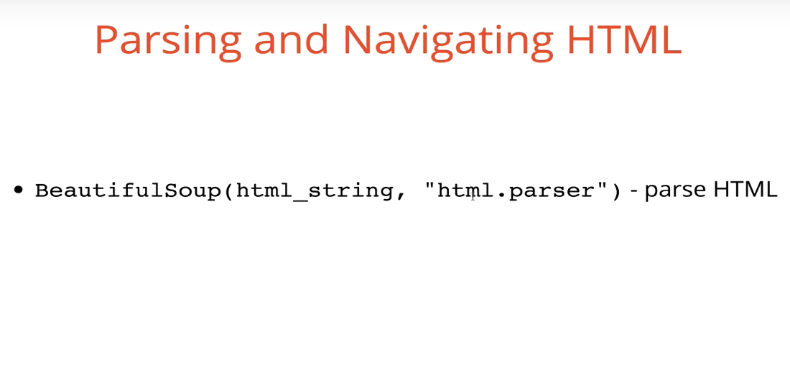
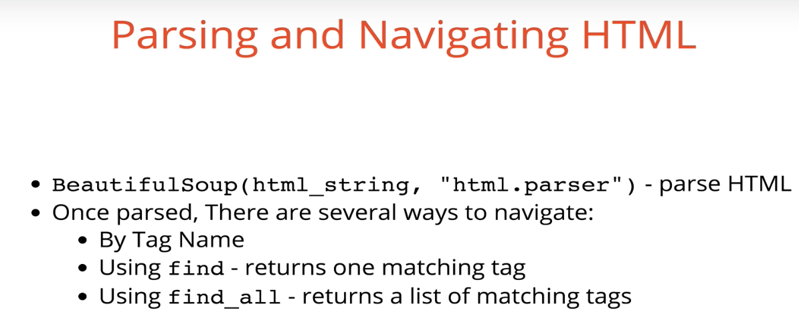
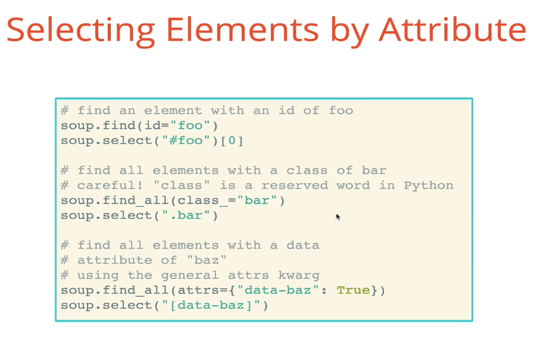
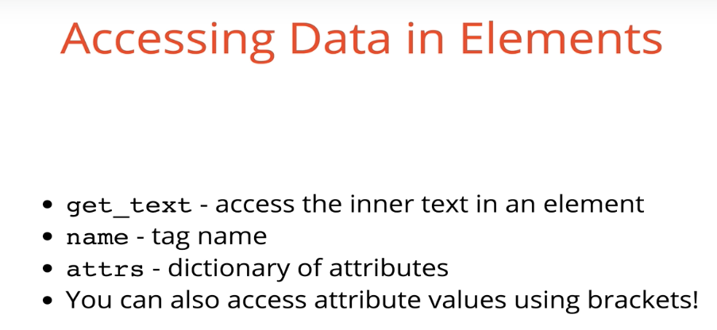
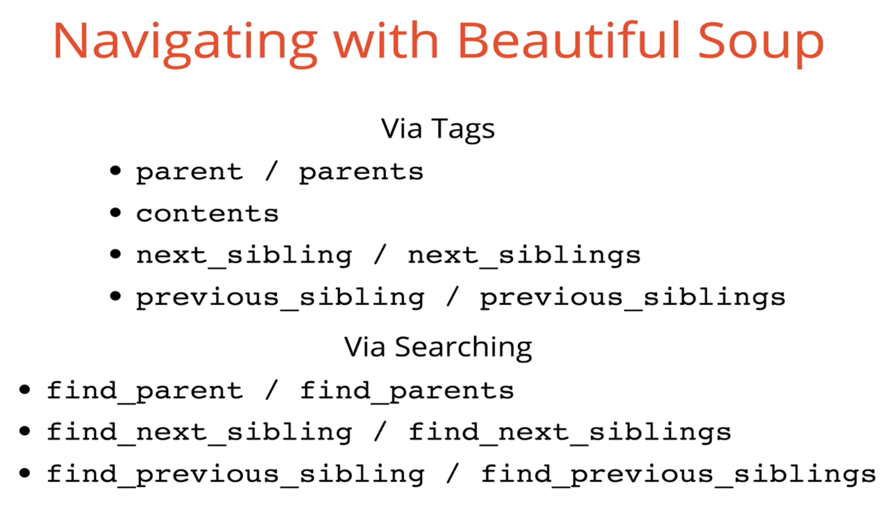

# Beautiful Soup Training 

## Web Scraping w/BeautifulSoup

Installing Beautiful Soup - In your terminal type python3 -m pip install bs4

Instructions in how to use:

For example, if you’re working with a file named beautiful_soup_two.py — after you have input your logic for whatever you’re trying to find in the HTML, go to your terminal and cd into the file and type python3 beautiful_soup_two.py

Parse by HTML
↓

Overall Review
↓

Accessing Data in Elements 
↓

Navigating with Beautiful Soup
↓

