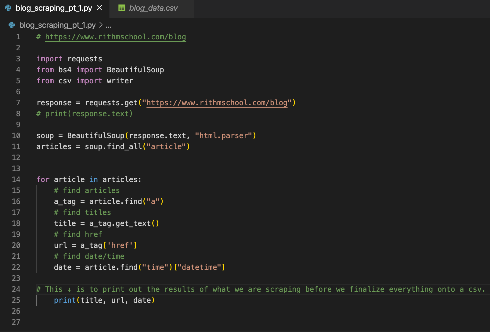
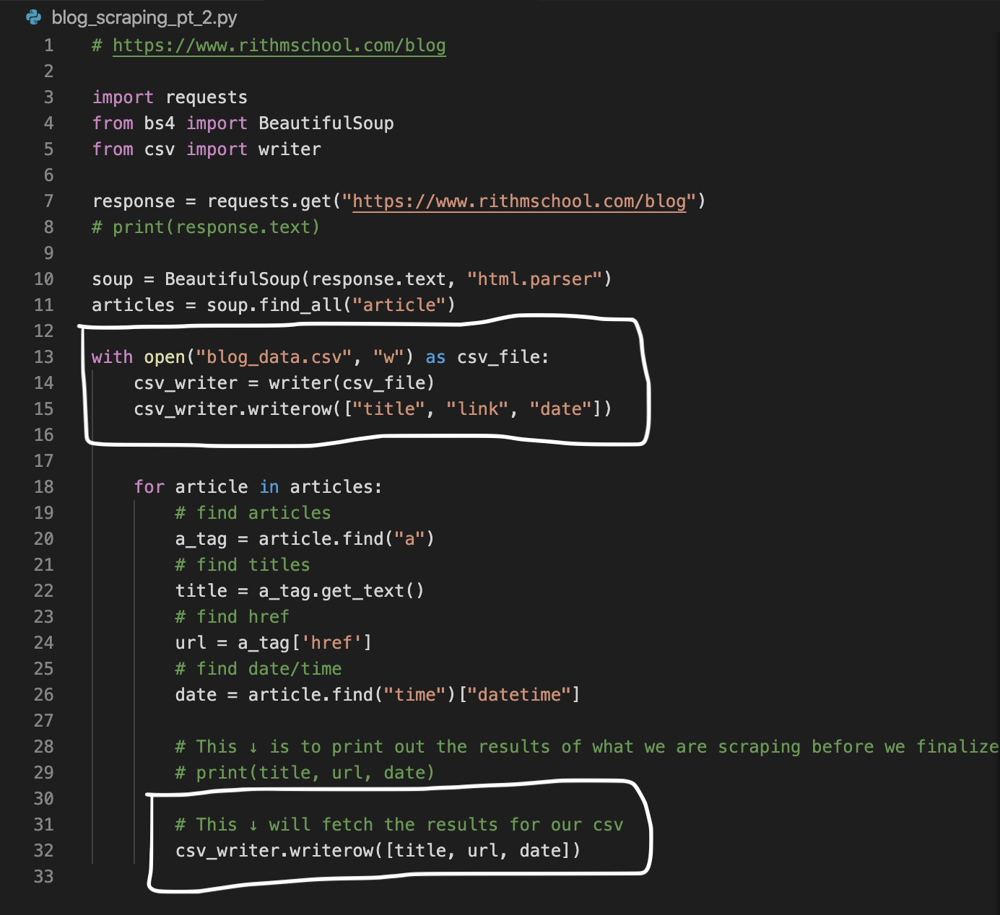

# Blog Scraping Project

In this project I scraped the Rithm School website (yes it is ok to scrape) https://www.rithmschool.com/blog

## Goals

Grab all links from Rithm School blog

Data: Store URL, anchor tag text and date

Finally - store it in a csv file

# #########################################
# #########################################

First we write our logic to scrape the titles, links and dates. 

then we will slightly do some tweaks to our code so we can retrive it in a csv file.

